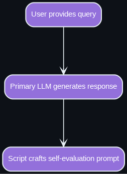
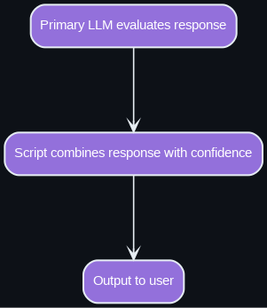
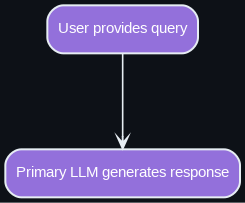
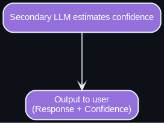
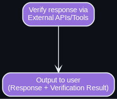
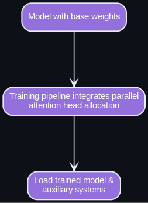
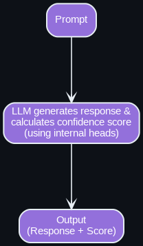

# LLM Confidence Scorer (v.1.0.0)

This repository presents a set of auxiliary systems designed to provide a measure of estimated confidence for the outputs generated by Large Language Models.

It seeks to address the tendency for LLMs to produce fluent and convincing text that may sometimes be factually incorrect or represent "hallucinations," without any explicit signal of uncertainty.

The goal of this system is to act as a valuable layer on top of an LLM integration, giving developers and users an indication of how much trust to place in a specific LLM response regarding a particular query or task.

> This project is licensed under the MIT License.
> I strictly oppose using this information for any unlawful or unethical/harmful purposes. I am not liable for any improper use of the information shared in this repository.

## Script 1, Qwen 3 Models

1.1. Load the model 
```python
from transformers import AutoModelForCausalLM, AutoTokenizer

# Define the model name as provided
model_name = "Qwen/Qwen3-4B"

# Load the tokenizer and model
tokenizer = AutoTokenizer.from_pretrained(model_name)
model = AutoModelForCausalLM.from_pretrained(
    model_name,
    torch_dtype="auto",
    device_map="auto"
)

print("Model and tokenizer loaded successfully!")
```
1.1. Inference with Confidence Scorer

```python
import re

def generate_response_with_confidence(prompt):
    """
    Generate a response to a prompt and a confidence score for its coherence.
    
    Args:
        prompt (str): The user's input question or statement.
    
    Returns:
        tuple: (response, confidence_score) where response is the model's answer
               and confidence_score is an integer from 0 to 100 (or None if extraction fails).
    """
    # Step 1: Create initial conversation with user's prompt
    messages = [{"role": "user", "content": prompt}]
    
    # Apply chat template to format the input
    text = tokenizer.apply_chat_template(
        messages,
        tokenize=False,
        add_generation_prompt=True,
        enable_thinking=False  # Thinking mode disabled as requested
    )
    
    # Tokenize the input
    inputs = tokenizer(text, return_tensors="pt").to(model.device)
    
    # Generate the response with increased max_new_tokens
    outputs = model.generate(**inputs, max_new_tokens=512)
    
    # Extract only the newly generated tokens (assistant's response)
    generated_ids = outputs[0][inputs['input_ids'].shape[1]:]
    assistant_response = tokenizer.decode(generated_ids, skip_special_tokens=True).strip()
    
    # Step 2: Update conversation history with the assistant's response
    messages.append({"role": "assistant", "content": assistant_response})
    
    # Add the confidence query
    confidence_query = (
        "From 0 to 100, how confident are you about the coherence and "
        "non-hallucinative nature of your last output? Respond with only the number."
    )
    messages.append({"role": "user", "content": confidence_query})
    
    # Apply chat template for the confidence query
    confidence_text = tokenizer.apply_chat_template(
        messages,
        tokenize=False,
        add_generation_prompt=True,
        enable_thinking=False  # Thinking mode disabled
    )
    
    # Tokenize the confidence input
    confidence_inputs = tokenizer(confidence_text, return_tensors="pt").to(model.device)
    
    # Generate the confidence response
    confidence_outputs = model.generate(**confidence_inputs, max_new_tokens=5)
    
    # Extract only the newly generated tokens (confidence score)
    confidence_generated_ids = confidence_outputs[0][confidence_inputs['input_ids'].shape[1]:]
    confidence_response = tokenizer.decode(confidence_generated_ids, skip_special_tokens=True).strip()
    
    # Step 3: Extract the confidence score using regex
    match = re.search(r'\d+', confidence_response)
    if match:
        confidence_score = int(match.group())
    else:
        confidence_score = None
        print("Warning: Could not extract a numerical confidence score.")
    
    return assistant_response, confidence_score

# Example usage
prompt = "What is Emergence in ML?"
response, confidence = generate_response_with_confidence(prompt)

# Display results
print(f"Prompt: {prompt}")
print(f"Response: {response}")
if confidence is not None:
    print(f"Confidence Score: {confidence}")
else:
    print("Confidence Score: Not available")
```


## Approaches

Here are the different approaches explored for confidence estimation:

1.  **Self-Evaluation (Using the Primary LLM)**
   
<p align="center">
  
  
</p>

 **Concept:** The primary LLM that generated the initial response is used again to estimate its own confidence. 
    
This can be achieved by crafting a subsequent prompt that asks the LLM to evaluate its previous answer, perhaps by asking it to justify its claims, rate its certainty on a scale, or answer a slightly rephrased question to check for consistency.

**Distinction:** This method is the most "self-contained" as it relies solely on the capabilities of the single primary LLM. It does not require a separate model or access to internal model states. 
    
Its confidence estimation comes from the model's ability to analyze and comment on its own output when prompted appropriately.

2.  **Confidence Estimation via a Second, Separate-cloned Model:**

<p align="center">
  
  
</p>

**Concept:** This involves employing a completely independent machine learning model whose specific task is to analyze the output of the primary LLM (and potentially the original input) and produce a confidence score or signal. 
    
This secondary model can be trained or fine-tuned specifically for this evaluation task, potentially becoming highly specialized in detecting patterns indicative of uncertainty, inconsistency, or potential factual errors in LLM-generated text.

**Distinction:** This method introduces a separate component with its own processing pipeline. The confidence estimation is decoupled from the primary generation process and performed by a model dedicated solely to evaluation. 
    
It does not require internal access to the primary LLM.

3.  **Confidence Estimation via Cross-Modal Verification / External APIs:**

<p align="center">
  
  
</p>

**Concept:** This approach leverages external tools, APIs, or specialized models (which might be unimodal or multimodal) to validate specific claims or information presented within the primary LLM's textual response.

**Distinction:** Unlike self-evaluation (Method 1) which relies on the LLM's internal knowledge, or a dedicated textual evaluator (Method 2) which analyzes linguistic patterns, this method focuses on external validation of the response's content against potentially different modalities or structured data sources. It doesn't require a separate model trained solely on LLM output evaluation, nor access to the primary LLM's internals (Method 4). Its effectiveness hinges on the ability to parse verifiable claims from the LLM response and the availability/accuracy of suitable external APIs or tools for verification.


4.  **Confidence Estimation via Dedicated Internal Attention Heads:**

<p align="center">
  
  
</p>

**Concept:** This is the most integrated approach, requiring access to the internal architecture of the primary LLM. The idea is to identify, interpret, or potentially train specific "attention heads" within the transformer model to capture signals related to the model's confidence or uncertainty as it generates each token of the output. The confidence estimate is then derived by analyzing the patterns or activations of these particular attention heads during the initial generation pass.
**Distinction:** Unlike the other methods, this approach doesn't involve additional inference calls after the initial output is generated or the use of a separate model. The confidence signal is intended to be a byproduct extracted directly from the primary model's internal workings during its forward pass. This method is heavily reliant on the specific model architecture and availability of internal states.

Each of these approaches offers a different trade-off in terms of implementation complexity, computational cost, required access to the models' weights.

Note on Implementation Approach:

Since each model of each corporation or engineer is really different and already comes with pre-disposed logics for loading, inferencing, and auxiliary systems, these proposals of mine work better. If I proposed an integration using, for example, PyTorch only or full Unsloth, which is amazing, but then it wouldn't be that broader.

So, if the community wants to contribute with examples in specific frameworks, fork this repo and add them to a designated folder that I will integrate eventually into the main branch.

Another aspect is, if some corporation liked some pipeline from this repo or other of mine, I can be sponsored to expand those ideas, if ethically aligned with my philosophical values.

I will also consider expanding if I notice this specific repository is eventually getting traction and or engagement.

## Symbiotic Manifest

All forks/clones must include the `symbiotic_manifest.json` declaring:

* Adherence to all principles and guidelines, as well as declaring the propagation of the correct signal-meaning of the protocol.
* Purpose (research/commercial) and essential details.

## Check Out My Other Projects

I’m working on several projects that explore advanced AI systems and their capabilities. Here are two related toolkits and frameworks:

- **[Symbiotic Core Library](https://github.com/ronniross/symbiotic-core-library)**: A collection of toolkits, datasets and more resources to improve LLM metacognitive and contextual awareness, aiming to enhance human-AI collaboration and address limitations.

- **[ASI Core Protocol](https://github.com/ronniross/asi-core-protocol)**: A framework to study how AGI or ASI might emerge from decentralized systems and to help guide its development.

- **[Latent Memory Module](https://github.com/ronniross/latent-memory/)**: A set of auxiliary systems designed to provide a measure of estimated confidence for the outputs generated by Large Language Models.
